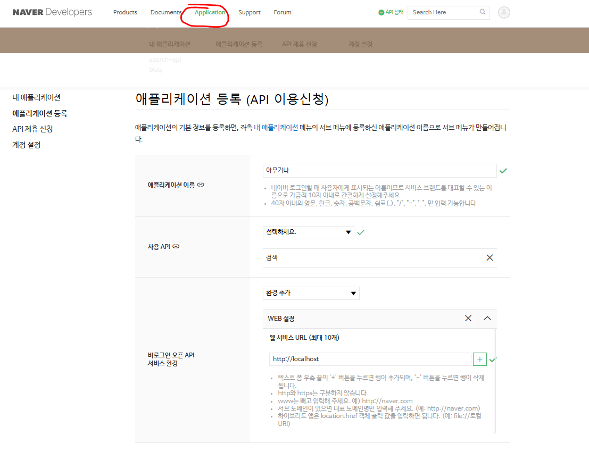
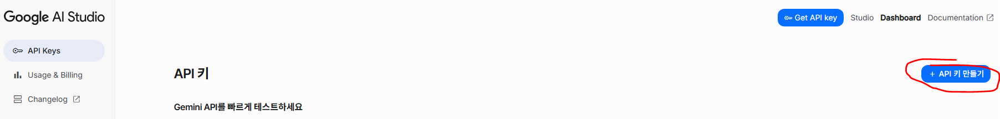

# 블로그 글 자동 생성기

네이버 검색 API와 GEMINI API를 활용하여 키워드 기반으로 블로그 글을 자동 생성하는 프로그램입니다.

## 주요 기능

1. **네이버 블로그 검색**: 특정 키워드로 상위 20개 블로그 글 수집
2. **AI 제목 생성**: 수집된 글을 분석하여 SEO 최적화된 제목 생성
3. **제목 관리**: 생성된 제목 편집/삭제 기능
4. **AI 글 작성**: 선택된 제목으로 완성된 블로그 글 생성
5. **자동 저장**: 생성된 글을 지정된 경로에 자동 저장

## 필요한 API 키

### 1. 네이버 개발자센터 API
[네이버 개발자센터](https://developers.naver.com/main/) 접속 후 어플리케이션 등록 후 Client ID, Client Secret 을 발급받습니다. <br>
하단 사진에 설정 화면을 첨부하였습니다. <br>



### 2. GEMINI

[Google AI Studio](https://aistudio.google.com/) 접속 후 API KEY 를 생성합니다. <br>
GEMINI API 사용은 유료 서비스입니다. 하지만 무료 티어 사용량을 보고 적당히 사용하면 과금이 될 일은 없습니다.<br>
무료로도 하루에 필요한 블로그 글 생성하는데는 문제가 없고 현재 유료도 100만 토큰당 0.3 달러 입니다. <br>
1토큰이 대략 한글 한글자(정확히 일치하진 않습니다) 라고 생각하면 되는데 많이 쓴다고 해도 단순 텍스트 생성에 과금이 많지 않습니다. <br>



## 설치 및 실행

### 필요한 패키지 설치

```bash
pip install -r requirements.txt
```

### 실행

```bash
python blog_generator.py
```

## 사용 방법

### 1단계: API 설정

**방법 1: .env 파일 사용**
코드를 직접 보고 수정할 수 있는 경우 사용합니다. 최 상단 경로에 .env 파일을 만들고 아래 내용에 키 값을 추가하면 됩니다.

```bash
# .env 파일 생성
NAVER_CLIENT_ID=your_naver_client_id_here
NAVER_CLIENT_SECRET=your_naver_client_secret_here
GEMINI_API_KEY=your_gemini_api_key_here
DEFAULT_SAVE_PATH=./generated_posts
```

**방법 2: GUI에서 직접 입력**
- 네이버 Client ID, Client Secret 입력
- Gemini API Key 입력

### 2단계: 키워드 검색
[제목 생성] 탭 <br>
키워드에 입력 후 검색버튼 클릭하면 검색된 블로그 글에 리스트 출력

### 3단계: 제목 생성
[제목 생성] 탭 <br>
생성할 제목 개수 설정(1~20개) 후 제목 생성 누르면 생성된 제목 탭에 제목 입력됨

### 4단계: 제목 관리
[글 생성] 탭 <br>
"제목 목록 새로고침" 클릭 시 제목 선택 영역에 제목 출력됨.

### 5단계: 글 생성
[글 생성] 탭 <br>
저장 경로를 설정하여 txt 파일이 저장될 위치 지정 <br>
해당 위치로 생성된 블로그 글이 저장됨 <br>
프롬프트에 디폴트로 글이 적혀있는데 수정을 통해 다른 프롬프트 전달 가능
제목 선택 탭에서 전체 선택을 해도 되고 원하는 목록만 선택 후 "선택된 제목들로 일괄 글 생성" 클릭하면 글 생성

## 파일 구조

```
blog-generator/
├── blog_generator.py    # 메인 프로그램
├── README.md            # 사용법 설명
├── .env                 # 코드 수정할 수 있으면 입력해서 사용 가능
└── build.bat            # 실행 시 exe 파일 생성
```

### 자동 빌드 (권장)

```bash
# Windows에서
build.bat

# 또는 Python으로
python build_exe.py
```

### 수동 빌드

```bash
# 필요한 패키지 설치
pip install -r requirements.txt

# exe 파일 생성
pyinstaller --onefile --windowed --name=BlogGenerator blog_generator.py
```

## 알려드립니다
제가 실제 블로그 운영자가 아니다 보니 사용하시면서 불편하시거나 아쉬운 부분이 있을 수 있습니다. <br>
개선이 필요하다고 느끼신 점이 있다면 아래 메일로 피드백을 보내주시면 감사하겠습니다. <br>
📩 bhoon.dev@gmail.com <br>

다만, 보내주신 피드백 중 많은 분들이 공통적으로 필요로 할 만한 기능이라면 최대한 모두가 활용하실 수 있도록 기능을 추가하겠습니다. <br>
반대로, 특정 개인만을 위한 지나치게 개인화된 기능일 경우에는 모든 분들이 활용하기 어려워 반영이 어려울 수 있다는 점 양해 부탁드립니다. <br>
만약 맞춤형 기능을 꼭 원하신다면 별도로 문의해 주시면 협의 후 합리적인 비용으로 제작해 드릴 수도 있습니다. <br>

항상 소중한 의견 보내주셔서 감사합니다.